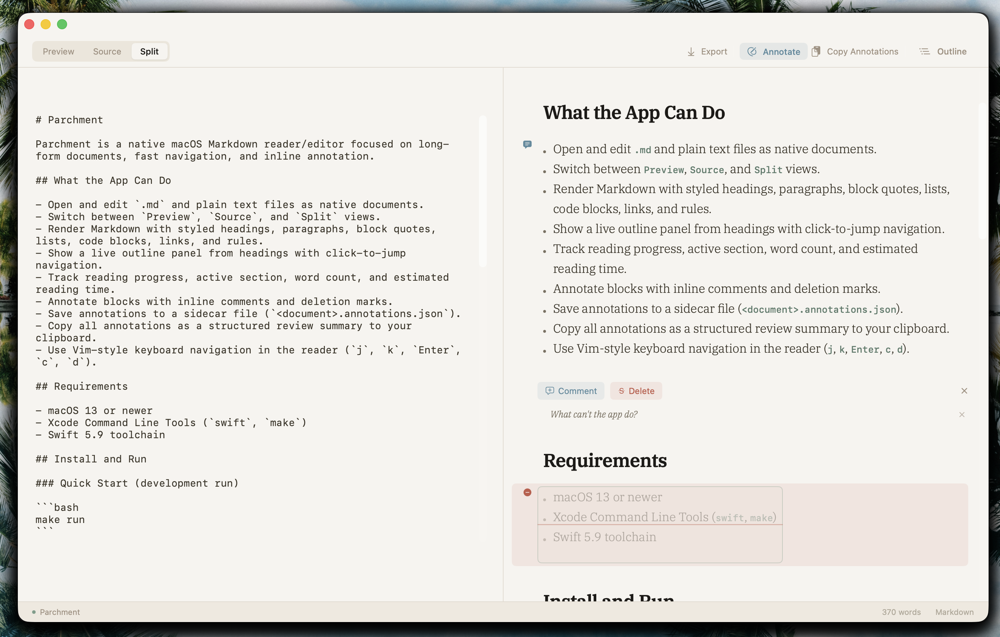

# Parchment

Parchment is a native macOS Markdown reader/editor focused on long-form documents, fast navigation, and inline annotation.

## Screenshot



## What the App Can Do

- Open and edit `.md` and plain text files as native documents.
- Switch between `Preview`, `Source`, and `Split` views.
- Render Markdown with styled headings, paragraphs, block quotes, lists, code blocks, links, and rules.
- Show a live outline panel from headings with click-to-jump navigation.
- Track reading progress, active section, word count, and estimated reading time.
- Annotate blocks with inline comments and deletion marks.
- Save annotations to a sidecar file (`<document>.annotations.json`).
- Copy all annotations as a structured review summary to your clipboard.
- Use Vim-style keyboard navigation in the reader (`j`, `k`, `Enter`, `c`, `d`).

## Requirements

- macOS 13 or newer
- Xcode Command Line Tools (`swift`, `make`)
- Swift 5.9 toolchain

## Install and Run

### Quick Start (development run)

```bash
make run
```

Builds the app, creates `Parchment.app` locally, and opens it.

### Open a specific file

```bash
make open FILE=/absolute/path/to/file.md
```

### Install to Applications

```bash
make install
```

Installs to `/Applications/Parchment.app`.

## Usage

1. Open a Markdown file.
2. Pick a view mode:
   - `Preview`: read-only rendered view
   - `Source`: raw Markdown editor
   - `Split`: source + preview side by side
3. Use the `Outline` button to toggle heading navigation.
4. Enable `Annotate` to comment on blocks or mark deletions.
5. Use `Copy Annotations` to export review notes to clipboard.

## Keyboard Navigation (Reader)

- `j`: move selection down one block
- `k`: move selection up one block
- `Enter`: select current block
- `c`: open comment flow for selected block
- `d`: toggle delete mark for selected block

## Annotations

- Comments and deletions are tied to markdown blocks.
- Annotation data is stored in a JSON sidecar file next to the document.
- Deletions are shown visually in preview and can be toggled off.
- Blank comments are ignored automatically.

## Testing

```bash
make test
```

Additional focused test target:

```bash
make test-double-submit
```

## Project Structure

- `Sources/Parchment`: app source code
- `Tests/ParchmentTests`: unit and behavior tests
- `Fixtures`: sample files for smoke checks
- `Makefile`: common build, run, install, and test commands
